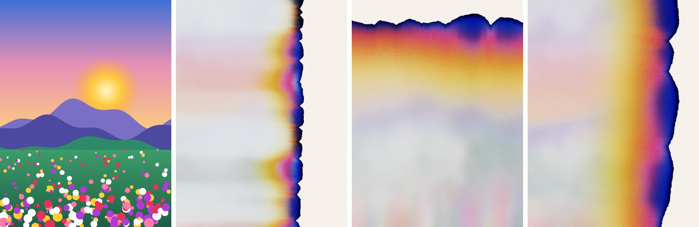
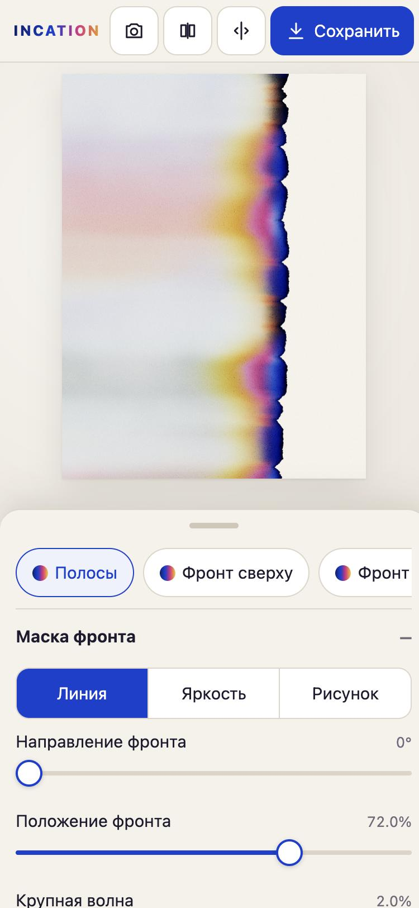

# INCATION

Веб-тул, который превращает фотографию в эффект **бумажной хроматографии**: чернила впитываются в мокрую акварельную бумагу и расслаиваются на пигменты — рваный фронт с гребешками, тёмная индиго-кромка, радужная кайма и пастельный размытый интерьер.

**Демо: https://pplakhin.github.io/incation/**



Всё работает прямо в браузере на WebGL2. Изображения никуда не отправляются: нет ни сервера, ни аналитики.

## Возможности

- Загрузка из галереи или камеры, перетаскивание файла, вставка из буфера обмена.
- Три источника маски фронта: **линия** (угол и положение), **яркость** исходника (порог и сглаживание), **рисунок** кистью прямо по превью.
- Слайдеры для гребешков и рваности кромки, ширины каймы, затемнения кромки, размытия и растекания интерьера, пастельности, зерна и грануляции бумаги.
- Редактируемая палитра пигментов: цвет, порядок, сила, дистанция от кромки. Запасной режим «градиент».
- Пресеты по мотивам референсов: «Полосы», «Фронт сверху», «Фронт справа», «Мягкий».
- Seed шума и кнопка «Случайно».
- Сравнение до/после: удерживайте кнопку или включите шторку и двигайте разделитель.
- Экспорт PNG в полном разрешении исходника. На iPhone и Android файл можно отправить через «Поделиться» и сохранить в Фото.
- PWA: устанавливается на главный экран и работает офлайн.



## Как это устроено

1. **Маска фронта** считается в разрешении до 768 px: линия, порог яркости размытого исходника или нарисованная маска. Граница искажается шумом.
2. **Поле расстояний** от фронта строится алгоритмом jump flooding на GPU. Координаты упакованы в RGBA8, поэтому всё рендерится на любом WebGL2, включая iOS.
3. **Хроматографическое разделение.** Каждый пигмент — «хребет» плотности на своей дистанции от фронта. Слои перемножаются субтрактивно (закон Бугера — Ламберта), и фиолетовые и оранжевые переходы появляются сами.
4. **Кромка.** Гребешки строятся на клеточном шуме Уорли в проекции на фронт, мелкая рваность — на fbm. У самого края пик плотности даёт эффект кофейного кольца; под гребешками — тёмные «карманы».
5. **Интерьер.** Исходник размыт (dual Kawase) и протянут вдоль градиента поля. Цвет раскладывается на CMY-плотности и собирается заново пигментами палитры, затем осветляется в пастель.
6. **Бумага.** Процедурное зерно холодного прессования и грануляция во впадинах, сильнее там, где больше пигмента.

Кромка, зерно и кайма вычисляются процедурно в координатах изображения, а поля — в низком разрешении. Поэтому экспорт в полном размере рендерится тайлами 1024 × 1024 и не требует огромных текстур.

## Ограничения

- Нужен WebGL2: Chrome, Edge, Firefox, Safari 15+ (iOS 15+). Без него показывается понятное сообщение.
- Размер экспорта ограничен холстом браузера: на телефонах до ~16,7 Мп, на компьютере до ~33 Мп. Если исходник больше, результат честно уменьшается, и тул об этом предупреждает.
- HEIC открывается только в Safari. В других браузерах используйте JPEG, PNG или WebP; на iPhone галерея сама отдаёт JPEG.
- Видео пока не поддерживается — это в планах.

## Запуск локально

Сборки и зависимостей нет — это статические файлы. ES-модули не работают по `file://`, поэтому нужен любой локальный сервер:

```bash
git clone https://github.com/pplakhin/incation.git
cd incation
python3 -m http.server 8080
```

Затем откройте http://localhost:8080. Подойдут и `npx serve`, и `ruby -run -e httpd . -p 8080`.

Service worker регистрируется только по HTTPS. Чтобы проверить офлайн-режим локально, откройте `http://localhost:8080/?sw`. После изменения файлов увеличьте `VERSION` в `sw.js`, чтобы установленные копии обновились.

## Структура

```
index.html             разметка
css/app.css            вёрстка: боковая панель на компьютере, выдвижная шторка на телефоне
js/main.js             загрузка фото, состояние, шторка, экспорт
js/ui.js               панель параметров и палитра
js/presets.js          значения по умолчанию и пресеты
js/renderer.js         конвейер WebGL2: размытие → маска → JFA → итоговый кадр
js/gl.js               обёртка над WebGL2
js/shaders/            GLSL: шум, маска и поле расстояний, размытие, итоговый кадр
js/paint.js            рисование маски кистью
js/compare.js          сравнение до/после
js/export.js           экспорт PNG, лимиты, «Поделиться»
js/sample.js           демо-картинка
sw.js, manifest.webmanifest, icons/   PWA
.github/workflows/pages.yml           деплой на GitHub Pages
```

## Деплой

Каждый push в `main` публикует сайт через GitHub Actions. В настройках репозитория должен быть включён Pages с источником **GitHub Actions** (Settings → Pages → Build and deployment → Source).

## Лицензия

[MIT](LICENSE)
